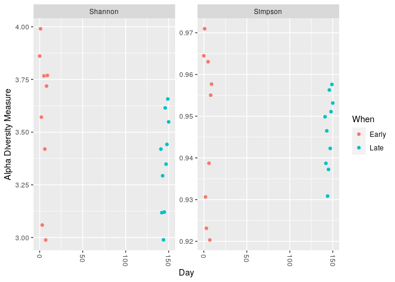
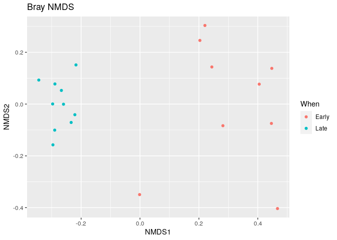

Tutorial Dada2 sur Phyloseq
================

  - [Phyloseq à partir du tutorial de
    Dada2](#phyloseq-à-partir-du-tutorial-de-dada2)
      - [Phyloseq](#phyloseq)
      - [Graphique](#graphique)
      - [Construction de l’arbre
        phylogénétique](#construction-de-larbre-phylogénétique)
      - [Fin du tutorial de Dada2](#fin-du-tutorial-de-dada2)

# Phyloseq à partir du tutorial de Dada2

## Phyloseq

``` r
load("02_data-analysis-with-DADA2_FinalEnv")
```

``` r
library(phyloseq)
```

``` r
samples.out<- rownames(seqtab.nochim)
subject <- sapply(strsplit(samples.out, "D"), `[`, 1)
gender <- substr(subject,1,1)
subject <- substr(subject,2,999)
day <- as.integer(sapply(strsplit(samples.out, "D"), `[`, 2))
samdf <- data.frame(Subject=subject, Gender=gender, Day=day)
samdf$When <- "Early"
samdf$When[samdf$Day>100] <- "Late"
rownames(samdf) <- samples.out
```

``` r
ps <- phyloseq(otu_table(seqtab.nochim, taxa_are_rows=FALSE), 
               sample_data(samdf), 
               tax_table(taxa))
ps <- prune_samples(sample_names(ps) != "Mock", ps) # Remove mock sample
```

ces différentes commandes vont permettre de ranger sous un même obejt
ps, toutes les données phyloseq. C’ets à dire les tables de données, les
arbres phylogénétiques etc…

``` r
dna <- Biostrings::DNAStringSet(taxa_names(ps))
names(dna) <- taxa_names(ps)
ps <- merge_phyloseq(ps, dna)
taxa_names(ps) <- paste0("ASV", seq(ntaxa(ps)))
ps
```

    ## phyloseq-class experiment-level object
    ## otu_table()   OTU Table:         [ 232 taxa and 19 samples ]
    ## sample_data() Sample Data:       [ 19 samples by 4 sample variables ]
    ## tax_table()   Taxonomy Table:    [ 232 taxa by 6 taxonomic ranks ]
    ## refseq()      DNAStringSet:      [ 232 reference sequences ]

## Graphique

``` r
plot_richness(ps, x="Day", measures=c("Shannon", "Simpson"), color="When")
```

    ## Warning in estimate_richness(physeq, split = TRUE, measures = measures): The data you have provided does not have
    ## any singletons. This is highly suspicious. Results of richness
    ## estimates (for example) are probably unreliable, or wrong, if you have already
    ## trimmed low-abundance taxa from the data.
    ## 
    ## We recommended that you find the un-trimmed data and retry.

<!-- --> Ce
graphique montre la richesse spécifique grâce à l’indice d’alpha
diversité de nos données présents dans ps en fonction du jour. Deux
indices sont ici mesurés, l’indice de Shannon et l’indice de Simpson. On
remarque que pour ces deux indices. Avec l’indice de Shannon on peut
voir qu’il n’y a pas de différences entre les échantillons précoses et
tardifs. On peut analyser la même chose avec l’indice de Simpson.

``` r
# Transform data to proportions as appropriate for Bray-Curtis distances
ps.prop <- transform_sample_counts(ps, function(otu) otu/sum(otu))
ord.nmds.bray <- ordinate(ps.prop, method="NMDS", distance="bray")
```

    ## Run 0 stress 0.08574537 
    ## Run 1 stress 0.08574537 
    ## ... New best solution
    ## ... Procrustes: rmse 2.050111e-06  max resid 4.30467e-06 
    ## ... Similar to previous best
    ## Run 2 stress 0.08002299 
    ## ... New best solution
    ## ... Procrustes: rmse 0.04283587  max resid 0.1433463 
    ## Run 3 stress 0.08942904 
    ## Run 4 stress 0.0942161 
    ## Run 5 stress 0.1330598 
    ## Run 6 stress 0.08942869 
    ## Run 7 stress 0.09421612 
    ## Run 8 stress 0.1358407 
    ## Run 9 stress 0.08942894 
    ## Run 10 stress 0.1319352 
    ## Run 11 stress 0.08942941 
    ## Run 12 stress 0.08942885 
    ## Run 13 stress 0.09421611 
    ## Run 14 stress 0.1216669 
    ## Run 15 stress 0.08942889 
    ## Run 16 stress 0.1264721 
    ## Run 17 stress 0.08002299 
    ## ... Procrustes: rmse 6.552415e-06  max resid 1.891875e-05 
    ## ... Similar to previous best
    ## Run 18 stress 0.08574537 
    ## Run 19 stress 0.08942879 
    ## Run 20 stress 0.08942906 
    ## *** Solution reached

On réalise ici une analyse de la bêta diversité en utilisant l’indices
de Bray Curtis. \#\# Faire un graphique d’ordination

``` r
plot_ordination(ps.prop, ord.nmds.bray, color="When", title="Bray NMDS")
```

<!-- --> Cette
ordination nous permets de voir que les indices précoses et tardifs sont
bien séparés. Il y a donc bien une différence entre les échantillons
lorsqu’on regarde la bêta diversité.

``` r
library(ggplot2)
```

``` r
top20 <- names(sort(taxa_sums(ps), decreasing=TRUE))[1:20]
ps.top20 <- transform_sample_counts(ps, function(OTU) OTU/sum(OTU))
ps.top20 <- prune_taxa(top20, ps.top20)
plot_bar(ps.top20, x="Day", fill="Family") + facet_wrap(~When, scales="free_x")
```

<!-- --> On a
donc fait en sorte de visualiser l’abondance de chaque taxons au sein
des échantillons précoses et tardifs. On voit que dans les deux cas le
taxon le plus présent est celui des Muribaculaceaes. Il semblerait que
l’abondance globale des échantillons tardifs, soit plus importante
mais nous ne pouvons pas conclure de façon significative qu’il y a bien
une différence entre les échantillons précoses et tardifs.

## Construction de l’arbre phylogénétique

Ces commandes ont été données par Mr. Maignien afin de nous expliquer
comment on pouvait construire un arbre phylogénétique. Elles se trouvent
dans le tutorial de Phyloseq et non sur celui de Dada2.

``` r
library(dada2)
```

    ## Loading required package: Rcpp

    ## Warning: multiple methods tables found for 'which'

``` r
library(DECIPHER)
```

    ## Loading required package: Biostrings

    ## Loading required package: BiocGenerics

    ## Loading required package: parallel

    ## 
    ## Attaching package: 'BiocGenerics'

    ## The following objects are masked from 'package:parallel':
    ## 
    ##     clusterApply, clusterApplyLB, clusterCall, clusterEvalQ,
    ##     clusterExport, clusterMap, parApply, parCapply, parLapply,
    ##     parLapplyLB, parRapply, parSapply, parSapplyLB

    ## The following objects are masked from 'package:stats':
    ## 
    ##     IQR, mad, sd, var, xtabs

    ## The following objects are masked from 'package:base':
    ## 
    ##     anyDuplicated, append, as.data.frame, basename, cbind, colnames,
    ##     dirname, do.call, duplicated, eval, evalq, Filter, Find, get, grep,
    ##     grepl, intersect, is.unsorted, lapply, Map, mapply, match, mget,
    ##     order, paste, pmax, pmax.int, pmin, pmin.int, Position, rank,
    ##     rbind, Reduce, rownames, sapply, setdiff, sort, table, tapply,
    ##     union, unique, unsplit, which.max, which.min

    ## Loading required package: S4Vectors

    ## Loading required package: stats4

    ## 
    ## Attaching package: 'S4Vectors'

    ## The following object is masked from 'package:base':
    ## 
    ##     expand.grid

    ## Loading required package: IRanges

    ## 
    ## Attaching package: 'IRanges'

    ## The following object is masked from 'package:phyloseq':
    ## 
    ##     distance

    ## Loading required package: XVector

    ## 
    ## Attaching package: 'Biostrings'

    ## The following object is masked from 'package:base':
    ## 
    ##     strsplit

    ## Loading required package: RSQLite

Il est important d’appeler ces deux library afin de que le getSequences
et les alignements multiples puissent s’exécuter.

``` r
seqs <- getSequences(seqtab.nochim)
names(seqs) <- seqs # This propagates to the tip labels of the tree
alignment <- AlignSeqs(DNAStringSet(seqs), anchor=NA,verbose=FALSE)
```

Ici nous avons donc réaliser les alignements multiples grâce à DECIPHER.
Cela nous permettra de construire l’arbre phylogénétique.

``` r
library(phangorn)
```

    ## Loading required package: ape

    ## 
    ## Attaching package: 'ape'

    ## The following object is masked from 'package:Biostrings':
    ## 
    ##     complement

``` r
phangAlign <- phyDat(as(alignment, "matrix"), type="DNA")
dm <- dist.ml(phangAlign)
treeNJ <- NJ(dm) # Note, tip order != sequence order
fit = pml(treeNJ, data=phangAlign)
```

    ## negative edges length changed to 0!

``` r
fitGTR <- update(fit, k=4, inv=0.2)
fitGTR <- optim.pml(fitGTR, model="GTR", optInv=TRUE, optGamma=TRUE,
        rearrangement = "stochastic", control = pml.control(trace = 0))
detach("package:phangorn", unload=TRUE)
```

Phangorn va nous permettre de réaliser l’arbre phylogénétique

``` r
ps <- phyloseq(otu_table(seqtab.nochim, taxa_are_rows=FALSE), 
               sample_data(samdf), 
               tax_table(taxa),phy_tree(fitGTR$tree))
ps <- prune_samples(sample_names(ps) != "Mock", ps) # Remove mock sample
ps
```

    ## phyloseq-class experiment-level object
    ## otu_table()   OTU Table:         [ 232 taxa and 19 samples ]
    ## sample_data() Sample Data:       [ 19 samples by 4 sample variables ]
    ## tax_table()   Taxonomy Table:    [ 232 taxa by 6 taxonomic ranks ]
    ## phy_tree()    Phylogenetic Tree: [ 232 tips and 230 internal nodes ]

Nous allons donc ranger toutes nos données phyloseq dans un objet ps,
qui contiendra notre arbre phylogéntique, les matrices etc…

## Fin du tutorial de Dada2
