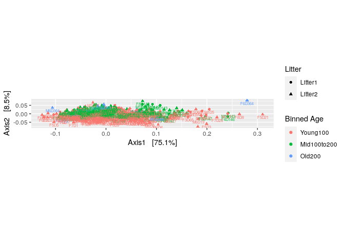

Phyloseq
================

  - [A partir des données du tutorial
    phyloseq](#a-partir-des-données-du-tutorial-phyloseq)
      - [Téléchargement des données du tuto
        PhyloSeq](#téléchargement-des-données-du-tuto-phyloseq)
      - [Filtrer la taxonomie](#filtrer-la-taxonomie)
  - [Compute prevalence of each feature, store as
    data.frame](#compute-prevalence-of-each-feature-store-as-data.frame)
      - [Define phyla to filter](#define-phyla-to-filter)
      - [Filtrer les phylas non
        identifiés](#filtrer-les-phylas-non-identifiés)
  - [Subset to the remaining phyla](#subset-to-the-remaining-phyla)
      - [Définir la prévalence](#définir-la-prévalence)
      - [Exécuter le filtre de
        prévalence](#exécuter-le-filtre-de-prévalence)
      - [How many genera would be present after
        filtering?](#how-many-genera-would-be-present-after-filtering)
      - [Plot regroupant les 3 arbres](#plot-regroupant-les-3-arbres)
  - [Plot d’abondance](#plot-dabondance)
      - [Plot d’abondance relative](#plot-dabondance-relative)
      - [Sous ensemble taxonomique](#sous-ensemble-taxonomique)
  - [Faire une PCoA](#faire-une-pcoa)
      - [Ordination sans valeurs
        aberrantes.](#ordination-sans-valeurs-aberrantes.)
      - [PCoA](#pcoa)
      - [PCoA rang](#pcoa-rang)
  - [Canocical analyse](#canocical-analyse)
      - [Supervised leaning method](#supervised-leaning-method)
      - [Production de biplot et de
        parcelles.](#production-de-biplot-et-de-parcelles.)
      - [plot](#plot)
  - [Graph based analyse](#graph-based-analyse)
      - [Plot](#plot-1)
  - [Nearest neighbors](#nearest-neighbors)
  - [Linear modeling](#linear-modeling)
      - [Filtrer les valeurs avec des barres
        d’erreurs](#filtrer-les-valeurs-avec-des-barres-derreurs)
  - [Hiérarchiser les tests
    multiples](#hiérarchiser-les-tests-multiples)
  - [Technique multitables](#technique-multitables)
      - [Data available](#data-available)

# A partir des données du tutorial phyloseq

## Téléchargement des données du tuto PhyloSeq

``` r
ps_connect <-url("https://raw.githubusercontent.com/spholmes/F1000_workflow/master/data/ps.rds")
ps = readRDS(ps_connect)
ps
```

    ## Loading required package: phyloseq

    ## phyloseq-class experiment-level object
    ## otu_table()   OTU Table:         [ 389 taxa and 360 samples ]
    ## sample_data() Sample Data:       [ 360 samples by 14 sample variables ]
    ## tax_table()   Taxonomy Table:    [ 389 taxa by 6 taxonomic ranks ]
    ## phy_tree()    Phylogenetic Tree: [ 389 tips and 387 internal nodes ]

Nous pouvons voir qu’il y a 360 séquences différents dans nos données
sur 389 initialement. Dans ces 360 séquences il y a 14 séquences
uniques.

## Filtrer la taxonomie

``` r
library(phyloseq)
rank_names(ps)
```

    ## [1] "Kingdom" "Phylum"  "Class"   "Order"   "Family"  "Genus"

``` r
table(tax_table(ps)[, "Phylum"], exclude = NULL)
```

    ## 
    ##              Actinobacteria               Bacteroidetes 
    ##                          13                          23 
    ## Candidatus_Saccharibacteria   Cyanobacteria/Chloroplast 
    ##                           1                           4 
    ##         Deinococcus-Thermus                  Firmicutes 
    ##                           1                         327 
    ##                Fusobacteria              Proteobacteria 
    ##                           1                          11 
    ##                 Tenericutes             Verrucomicrobia 
    ##                           1                           1 
    ##                        <NA> 
    ##                           6

Nous pouvons visualiser les différents phylum avec l’abondance de
chacun. Nous noterons que le phylum des Firmicutes est le plus
important. Nous avons choisi d’exclure du tableaux les séquences qui
n’avaient pas d’affiliation taxoniquement.

``` r
ps <- subset_taxa(ps, !is.na(Phylum) & !Phylum %in% c("", "uncharacterized"))
```

# Compute prevalence of each feature, store as data.frame

``` r
prevdf = apply(X = otu_table(ps),
               MARGIN = ifelse(taxa_are_rows(ps), yes = 1, no = 2),
               FUN = function(x){sum(x > 0)})
# Add taxonomy and total read counts to this data.frame
prevdf = data.frame(Prevalence = prevdf,
                    TotalAbundance = taxa_sums(ps),
                    tax_table(ps))
```

Nous allons ici calculer les prévalences de chaque phylum afin de savoir
si il y a des phylum avec de faibles prévalences.

``` r
plyr::ddply(prevdf, "Phylum", function(df1){cbind(mean(df1$Prevalence),sum(df1$Prevalence))})
```

    ##                         Phylum         1     2
    ## 1               Actinobacteria 120.15385  1562
    ## 2                Bacteroidetes 265.52174  6107
    ## 3  Candidatus_Saccharibacteria 280.00000   280
    ## 4    Cyanobacteria/Chloroplast  64.25000   257
    ## 5          Deinococcus-Thermus  52.00000    52
    ## 6                   Firmicutes 179.24771 58614
    ## 7                 Fusobacteria   2.00000     2
    ## 8               Proteobacteria  59.09091   650
    ## 9                  Tenericutes 234.00000   234
    ## 10             Verrucomicrobia 104.00000   104

Nous remarquons donc que les phylums des Fusobacteria et des Deinococcus
ont une faible prévelance par rapport aux autres données.

## Define phyla to filter

``` r
filterPhyla = c("Fusobacteria", "Deinococcus-Thermus")
```

Ici nous enlevons donc les phylums avec une prévelance faible.

## Filtrer les phylas non identifiés

``` r
ps1 = subset_taxa(ps, !Phylum %in% filterPhyla)
ps1
```

    ## phyloseq-class experiment-level object
    ## otu_table()   OTU Table:         [ 381 taxa and 360 samples ]
    ## sample_data() Sample Data:       [ 360 samples by 14 sample variables ]
    ## tax_table()   Taxonomy Table:    [ 381 taxa by 6 taxonomic ranks ]
    ## phy_tree()    Phylogenetic Tree: [ 381 tips and 379 internal nodes ]

On a donc refait un objet avec nos données filtrées, sans les séquences
qui n’avaient pas d’affiliation taxonomique et sans les phylums peu
présents.

# Subset to the remaining phyla

``` r
library(ggplot2)
prevdf1 = subset(prevdf, Phylum %in% get_taxa_unique(ps1, "Phylum"))
ggplot(prevdf1, aes(TotalAbundance, Prevalence / nsamples(ps),color=Phylum)) +
  # Include a guess for parameter
  geom_hline(yintercept = 0.05, alpha = 0.5, linetype = 2) +  geom_point(size = 2, alpha = 0.7) +
  scale_x_log10() +  xlab("Total Abundance") + ylab("Prevalence [Frac. Samples]") +
  facet_wrap(~Phylum) + theme(legend.position="none")
```

<!-- -->
Chaque graphique représente un phylum. Chacun des points de chaque
graphique, représente un taxa appartenant au phylum en question. On
regarde donc la prévalence des échantillons en fonction de leur
abondance totale. Comme vu précédement on remarque que les Firmicutes
ont une forte abondance et une forte prévalence

## Définir la prévalence

``` r
prevalenceThreshold = 0.05 * nsamples(ps)
prevalenceThreshold
```

    ## [1] 18

Ici on va définir un seuil de prévelance de 5% dans nos échantillons. Il
nous reste donc 18 phylums.

## Exécuter le filtre de prévalence

``` r
keepTaxa = rownames(prevdf1)[(prevdf1$Prevalence >= prevalenceThreshold)]
ps2 = prune_taxa(keepTaxa, ps)
```

On va donc exécuter notre seuil de prévalence à nos données et on va
faire un arbre phylogénétique en fonction de la taxonomie.

## How many genera would be present after filtering?

``` r
length(get_taxa_unique(ps2, taxonomic.rank = "Genus"))
```

    ## [1] 49

``` r
ps3 = tax_glom(ps2, "Genus", NArm = TRUE)
```

Ici on va faire un arbre phylogénétique en impliquant les distances
génétiques respectives entre chaque espèces. Ca peut s’apparenter au
cultering par OTU.

``` r
h1 = 0.4
ps4 = tip_glom(ps2, h = h1)
```

Ici on va juste comparer les 3 arbres phylogénétiques que nous avons
réalisé juste avant. h1 va permettre de fixer la distance génétique à
0,4.

``` r
multiPlotTitleTextSize = 15
p2tree = plot_tree(ps2, method = "treeonly",
                   ladderize = "left",
                   title = "Before Agglomeration") +
  theme(plot.title = element_text(size = multiPlotTitleTextSize))
p3tree = plot_tree(ps3, method = "treeonly",
                   ladderize = "left", title = "By Genus") +
  theme(plot.title = element_text(size = multiPlotTitleTextSize))
p4tree = plot_tree(ps4, method = "treeonly",
                   ladderize = "left", title = "By Height") +
  theme(plot.title = element_text(size = multiPlotTitleTextSize))
```

Ici on va juste mettre en page nos arbres phylogénétiques avec des
légendes.

## Plot regroupant les 3 arbres

``` r
library(gridExtra)
grid.arrange(nrow = 1, p2tree, p3tree, p4tree)
```

<!-- --> Le
premier arbre correspond à l’arbre avec les taxons non filtrés, au
milieu il sagit de l’arbre phylogénétique après filtration et avec
assignation taxonomique. enfin le dernier arbre représente celui ayant
intégré les distances phylogénétiques fixe. On remarque que les arbres
phylogénétiques sont différents en fonction de ce que nous avons utilisé
pour le créer.

# Plot d’abondance

``` r
plot_abundance = function(physeq,title = "",
                          Facet = "Order", Color = "Phylum"){
  # Arbitrary subset, based on Phylum, for plotting
  p1f = subset_taxa(physeq, Phylum %in% c("Firmicutes"))
  mphyseq = psmelt(p1f)
  mphyseq <- subset(mphyseq, Abundance > 0)
  ggplot(data = mphyseq, mapping = aes_string(x = "sex",y = "Abundance",
                              color = Color, fill = Color)) +
    geom_violin(fill = NA) +
    geom_point(size = 1, alpha = 0.3,
               position = position_jitter(width = 0.3)) +
    facet_wrap(facets = Facet) + scale_y_log10()+
    theme(legend.position="none")
}
```

On va utiliser phyloseq pour définir notre graphique d’abondance
relative.

``` r
ps3ra = transform_sample_counts(ps3, function(x){x / sum(x)})
```

Les dénombrements vont être transformés en abondances relatives, c’est à
dire en fréquences.

## Plot d’abondance relative

``` r
plotBefore = plot_abundance(ps3,"")
plotAfter = plot_abundance(ps3ra,"")
grid.arrange(nrow = 1,  plotBefore, plotAfter)
```

<!-- --> On
va tracer l’abondance avant et après le traitement des données. On
remarque donc que dans l’abondance relative (qui prends en compte le
nombre total de l’espèce en question par rapport au nombre d’individu
total de toutes les espèces), sont plus faible que les abondances pour
Clostriales, même si l’abondances relatives reste très forte. On
remarque aussi que les Clostriales ont une abondances relative, plus
forte que celle des Bacillales.

## Sous ensemble taxonomique

``` r
psOrd = subset_taxa(ps3ra, Order == "Lactobacillales")
plot_abundance(psOrd, Facet = "Genus", Color = NULL)
```

<!-- --> Ici
nous regarderons les Lactobacillales, regroupés par sexe de la personne
(donc femme et homme). On voit donc voir une différences sur les
graphiques de Lactobacillus et Streptococcus. Il n’y a donc pas la même
abondance entre ces deux genres. enrevanche il ne semble pas y avoir de
différences de répartition de ces genres qu’on soit chez une femme ou un
homme.

``` r
qplot(sample_data(ps)$age, geom = "histogram",binwidth=20) + xlab("age")
```

<!-- --> On
voit une covariance avec l’âge. Comment déduire qu’il faut traiter les
données? Il faut créer une variable avec l’âge car il y a trop de
différences? Je ne comprends pas.

``` r
qplot(log10(rowSums(otu_table(ps))),binwidth=0.2) +
  xlab("Logged counts-per-sample")
```

<!-- --> Je
ne comprends pas ce que montre les graphiques? Comment les analyser?

# Faire une PCoA

``` r
sample_data(ps)$age_binned <- cut(sample_data(ps)$age,
                          breaks = c(0, 100, 200, 400))
levels(sample_data(ps)$age_binned) <- list(Young100="(0,100]", Mid100to200="(100,200]", Old200="(200,400]")
sample_data(ps)$family_relationship=gsub(" ","",sample_data(ps)$family_relationship)
pslog <- transform_sample_counts(ps, function(x) log(1 + x))
out.wuf.log <- ordinate(pslog, method = "MDS", distance = "wunifrac")
```

    ## Warning in UniFrac(physeq, weighted = TRUE, ...): Randomly assigning root as --
    ## GCAAGCGTTATCCGGAATGATTGGGCGTAAAGCGTCTGTAGGTGGCTTTTTAAGTTCGCCGTCAAATCCCAGGGCTCAACCCTGGACAGGCGGTGGAAACTACCAAGCTGGAGTACGGTAGGGGCAGAGGGAATTTCCGGTGGAGCGGTGAAATGCGTAGAGATCGGAAAGAACACCAACGGCGAAAGCACTCTGCTGGGCCGACACTGACACTGAGAGACGAAAGCTAGGGGAG
    ## -- in the phylogenetic tree in the data you provided.

``` r
evals <- out.wuf.log$values$Eigenvalues
plot_ordination(pslog, out.wuf.log, color = "age_binned") +
  labs(col = "Binned Age") +
  coord_fixed(sqrt(evals[2] / evals[1]))
```

<!-- --> On
réalise une PCoA en utilisant l’indice de dissimilarité de Bray-Curtis
en ce basant sur la distance pondérée d’UniFrac. On obtient donc une
ordination. On remarque qu’il y a quelques points aberrants qui
semblerait être ceux en bas du graphique et à droite.

``` r
rel_abund <- t(apply(otu_table(ps), 1, function(x) x / sum(x)))
qplot(rel_abund[, 12], geom = "histogram",binwidth=0.05) +
  xlab("Relative abundance")
```

<!-- --> On
peut donc verifier ces valeurs aberrantes. Pour ça les auteurs ont
remarqué que pour deux échantillons, leur abondances relatives étaient
de 90% à ce moment là alors que cet ASV, dans le reste de l’étude, avait
une abondances relatives inférieur à 20%. Ils ont aussi remarqué que sa
diversité était la plus faible. Comment font-ils la liaison?

## Ordination sans valeurs aberrantes.

``` r
outliers <- c("F5D165", "F6D165", "M3D175", "M4D175", "M5D175", "M6D175")
ps <- prune_samples(!(sample_names(ps) %in% outliers), ps)
```

Nous allons filtrer nos échantillons en enlevant les valeurs aberrantes
que nous avons identifiés juste avant (comment ont ils fais pour savoir
quel point aberrant correspond à quelle donnée?). Calcul des ordinations
sans ces valeurs aberrantes.

``` r
which(!rowSums(otu_table(ps)) > 1000)
```

    ## F5D145 M1D149   M1D9 M2D125  M2D19 M3D148 M3D149   M3D3   M3D5   M3D8 
    ##     69    185    200    204    218    243    244    252    256    260

``` r
ps <- prune_samples(rowSums(otu_table(ps)) > 1000, ps)
pslog <- transform_sample_counts(ps, function(x) log(1 + x))
```

Enlever les échantillons avec moins de 1000 reads.

## PCoA

``` r
out.pcoa.log <- ordinate(pslog,  method = "MDS", distance = "bray")
evals <- out.pcoa.log$values[,1]
plot_ordination(pslog, out.pcoa.log, color = "age_binned",
                  shape = "family_relationship") +
  labs(col = "Binned Age", shape = "Litter")+
  coord_fixed(sqrt(evals[2] / evals[1]))
```

<!-- -->
Cette nouvelle PCoA est donc réalisée avec des données où les valeurs
aberrantes ont été enlevées. Nous observons qu’il y a un effet de l’âge.

``` r
out.dpcoa.log <- ordinate(pslog, method = "DPCoA")
evals <- out.dpcoa.log$eig
plot_ordination(pslog, out.dpcoa.log, color = "age_binned", label= "SampleID",
                  shape = "family_relationship") +
  labs(col = "Binned Age", shape = "Litter")+
  coord_fixed(sqrt(evals[2] / evals[1]))
```

<!-- --> Je
ne sais pas quoi déduire de cette DPCoA? Il y a là aussi une séparation
en fonction de l’âge?

``` r
plot_ordination(pslog, out.dpcoa.log, type = "species", color = "Phylum") +
  coord_fixed(sqrt(evals[2] / evals[1]))
```

<!-- --> Ici
nous utilisons les valeurs pondorées sous UniFrac. Comme avec la
première DPCoA nous voyons qu’il y a bien un effet de l’âge. Les
Firmicutes se retrouvent beaucoup chez les jeunes souris. On voit que
chez des souris plus âgées il y a un mélange de différents phylums.
Alors que chez les souris les plus vieille il semblerait que ce soit les
Bacteroides qui prédominent.

``` r
out.wuf.log <- ordinate(pslog, method = "PCoA", distance ="wunifrac")
```

    ## Warning in UniFrac(physeq, weighted = TRUE, ...): Randomly assigning root as --
    ## GCAAGCGTTATCCGGATTTACTGGGTGTAAAGGGAGCGTAGGCGGCGCGTTAAGTCTGATGTGAAAACCCGAGGCTCAACCACGGGAGTGCATTGGAAACTGGCGAGCTGGAGTGCCGGAGAGGTAAGCGGAATTCCTAGTGTAGCGGTGAAATGCGTAGATATTAGGAGGAACACCAGTGGCGAAGGCGGCTTACTGGACGGCAACTGACGCTGAGGCTCGAAAGCGTGGGGAG
    ## -- in the phylogenetic tree in the data you provided.

``` r
evals <- out.wuf.log$values$Eigenvalues
plot_ordination(pslog, out.wuf.log, color = "age_binned",
                  shape = "family_relationship") +
  coord_fixed(sqrt(evals[2] / evals[1])) +
  labs(col = "Binned Age", shape = "Litter")
```

<!-- -->

## PCoA rang

``` r
abund <- otu_table(pslog)
abund_ranks <- t(apply(abund, 1, rank))
```

Création d’une nouvelle matrice en regroupant les abondances en fonction
de leur rang. L’échantillon le plus petit sera au rang 1, le second plus
petit au rang 2 etc..

``` r
abund_ranks <- abund_ranks - 329
abund_ranks[abund_ranks < 1] <- 1
```

Pour éviter de créer trop de rang et avoir des biais, on va fixer un
seuil où tous les échantillons inférieur à ce seuil seront regroupés
dans le rang 1.

``` r
library(dplyr)
```

    ## 
    ## Attaching package: 'dplyr'

    ## The following object is masked from 'package:gridExtra':
    ## 
    ##     combine

    ## The following objects are masked from 'package:stats':
    ## 
    ##     filter, lag

    ## The following objects are masked from 'package:base':
    ## 
    ##     intersect, setdiff, setequal, union

``` r
library(reshape2)
abund_df <- melt(abund, value.name = "abund") %>%
  left_join(melt(abund_ranks, value.name = "rank"))
```

    ## Joining, by = c("Var1", "Var2")

``` r
colnames(abund_df) <- c("sample", "seq", "abund", "rank")

abund_df <- melt(abund, value.name = "abund") %>%
  left_join(melt(abund_ranks, value.name = "rank"))
```

    ## Joining, by = c("Var1", "Var2")

``` r
colnames(abund_df) <- c("sample", "seq", "abund", "rank")

sample_ix <- sample(1:nrow(abund_df), 8)
ggplot(abund_df %>%
         filter(sample %in% abund_df$sample[sample_ix])) +
  geom_point(aes(x = abund, y = rank, col = sample),
             position = position_jitter(width = 0.2), size = 1.5) +
  labs(x = "Abundance", y = "Thresholded rank") +
  scale_color_brewer(palette = "Set2")
```

<!-- --> On
observe ici la PCoA de l’abondance en fonction du rang. On voit que plus
le rang est élevé plus l’abondance l’est aussi. Il est important de
noter qu’il est plus simple d’utiliser les rangs que les abondances
brutes.

``` r
library(ade4)
ranks_pca <- dudi.pca(abund_ranks, scannf = F, nf = 3)
row_scores <- data.frame(li = ranks_pca$li,
                         SampleID = rownames(abund_ranks))
col_scores <- data.frame(co = ranks_pca$co,
                         seq = colnames(abund_ranks))
tax <- tax_table(ps) %>%
  data.frame(stringsAsFactors = FALSE)
tax$seq <- rownames(tax)
main_orders <- c("Clostridiales", "Bacteroidales", "Lactobacillales",
                 "Coriobacteriales")
tax$Order[!(tax$Order %in% main_orders)] <- "Other"
tax$Order <- factor(tax$Order, levels = c(main_orders, "Other"))
tax$otu_id <- seq_len(ncol(otu_table(ps)))
row_scores <- row_scores %>%
  left_join(sample_data(pslog))
```

    ## Joining, by = "SampleID"

    ## Warning in class(x) <- c(setdiff(subclass, tibble_class), tibble_class): Setting
    ## class(x) to multiple strings ("tbl_df", "tbl", ...); result will no longer be an
    ## S4 object

``` r
col_scores <- col_scores %>%
  left_join(tax)
```

    ## Joining, by = "seq"

Ici on va donc classer les abondances en fonction du rang en tenant
compte du phylum. Les phylums les plus importants étant Clostridiales,
Bacteroidales, Lactobacillales et Coriobacteriales. Les autres phylums,
moins important, seront classés dans autre.

``` r
evals_prop <- 100 * (ranks_pca$eig / sum(ranks_pca$eig))
ggplot() +
  geom_point(data = row_scores, aes(x = li.Axis1, y = li.Axis2), shape = 2) +
  geom_point(data = col_scores, aes(x = 25 * co.Comp1, y = 25 * co.Comp2, col = Order),
             size = .3, alpha = 0.6) +
  scale_color_brewer(palette = "Set2") +
  facet_grid(~ age_binned) +
  guides(col = guide_legend(override.aes = list(size = 3))) +
  labs(x = sprintf("Axis1 [%s%% variance]", round(evals_prop[1], 2)),
       y = sprintf("Axis2 [%s%% variance]", round(evals_prop[2], 2))) +
  coord_fixed(sqrt(ranks_pca$eig[2] / ranks_pca$eig[1])) +
  theme(panel.border = element_rect(color = "#787878", fill = alpha("white", 0)))
```

<!-- -->
Trois graphiques ont été réalisé en fonction de l’âge. On remarque que
les abondances sont différentes en focntion de l’âge ce qui confirme les
résultats obtenus avant.

# Canocical analyse

``` r
ps_ccpna <- ordinate(pslog, "CCA", formula = pslog ~ age_binned + family_relationship)
```

Le but ici est de déterminer, comme avec le PCoA, quel(s) types de
communautés sont plus importantes chez les souris.

``` r
library(ggrepel)
ps_scores <- vegan::scores(ps_ccpna)
sites <- data.frame(ps_scores$sites)
sites$SampleID <- rownames(sites)
sites <- sites %>%
  left_join(sample_data(ps))
```

    ## Joining, by = "SampleID"

    ## Warning in class(x) <- c(setdiff(subclass, tibble_class), tibble_class): Setting
    ## class(x) to multiple strings ("tbl_df", "tbl", ...); result will no longer be an
    ## S4 object

``` r
species <- data.frame(ps_scores$species)
species$otu_id <- seq_along(colnames(otu_table(ps)))
species <- species %>%
  left_join(tax)
```

    ## Joining, by = "otu_id"

``` r
evals_prop <- 100 * ps_ccpna$CCA$eig[1:2] / sum(ps_ccpna$CA$eig)
ggplot() +
  geom_point(data = sites, aes(x = CCA1, y = CCA2), shape = 2, alpha = 0.5) +
  geom_point(data = species, aes(x = CCA1, y = CCA2, col = Order), size = 0.5) +
  geom_text_repel(data = species %>% filter(CCA2 < -2),
                    aes(x = CCA1, y = CCA2, label = otu_id),
            size = 1.5, segment.size = 0.1) +
  facet_grid(. ~ family_relationship) +
  guides(col = guide_legend(override.aes = list(size = 3))) +
  labs(x = sprintf("Axis1 [%s%% variance]", round(evals_prop[1], 2)),
        y = sprintf("Axis2 [%s%% variance]", round(evals_prop[2], 2))) +
  scale_color_brewer(palette = "Set2") +
  coord_fixed(sqrt(ps_ccpna$CCA$eig[2] / ps_ccpna$CCA$eig[1])*0.45   ) +
  theme(panel.border = element_rect(color = "#787878", fill = alpha("white", 0)))
```

<!-- --> Ici
nous allons décider d’annoter seulement les 4 taxons les plus
importants, car c’est eux qui nous intéressent le plus dans cette étude.
Nous observons ainsi deux biplots.

## Supervised leaning method

``` r
library(caret)
```

    ## Loading required package: lattice

``` r
sample_data(pslog)$age2 <- cut(sample_data(pslog)$age, c(0, 100, 400))
dataMatrix <- data.frame(age = sample_data(pslog)$age2, otu_table(pslog))
# take 8 mice at random to be the training set, and the remaining 4 the test set
trainingMice <- sample(unique(sample_data(pslog)$host_subject_id), size = 8)
inTrain <- which(sample_data(pslog)$host_subject_id %in% trainingMice)
training <- dataMatrix[inTrain,]
testing <- dataMatrix[-inTrain,]
plsFit <- train(age ~ ., data = training,
                method = "pls", preProc = "center")
```

On va séparer les données en les affectant aux souris correspondantes
plutôt que par echantillons. Nous faisons un modèle de prédiction.

``` r
plsClasses <- predict(plsFit, newdata = testing)
table(plsClasses, testing$age)
```

    ##            
    ## plsClasses  (0,100] (100,400]
    ##   (0,100]        65         0
    ##   (100,400]       8        48

Nous allons donc appliquer notre prédiction à nos données et voir
comment elles sont réparties. Le modèle de prédiction semble être assez
bon étant donné qu’il a bien classé les données des souris jeunes au bon
endroit. On remarque aussi qu’il y a 2 souris vieilles qui ont été
classées dans les jeunes.

``` r
library(randomForest)
```

    ## randomForest 4.6-14

    ## Type rfNews() to see new features/changes/bug fixes.

    ## 
    ## Attaching package: 'randomForest'

    ## The following object is masked from 'package:dplyr':
    ## 
    ##     combine

    ## The following object is masked from 'package:gridExtra':
    ## 
    ##     combine

    ## The following object is masked from 'package:ggplot2':
    ## 
    ##     margin

``` r
rfFit <- train(age ~ ., data = training, method = "rf",
               preProc = "center", proximity = TRUE)
rfClasses <- predict(rfFit, newdata = testing)
table(rfClasses, testing$age)
```

    ##            
    ## rfClasses   (0,100] (100,400]
    ##   (0,100]        72         7
    ##   (100,400]       1        41

Il y a une autre méthode afin de classer les données en fonction de la
souris et non de l’échantillon. Le package randomForest permet de le
faire.

## Production de biplot et de parcelles.

``` r
library(vegan)
```

    ## Loading required package: permute

    ## This is vegan 2.5-6

    ## 
    ## Attaching package: 'vegan'

    ## The following object is masked from 'package:caret':
    ## 
    ##     tolerance

``` r
#Importer les lignes de scores avec la library
pls_biplot <- list("loadings" = loadings(plsFit$finalModel),
                   "scores" = scores(plsFit$finalModel))
class(pls_biplot$scores) <- "matrix"

pls_biplot$scores <- data.frame(sample_data(pslog)[inTrain, ],
                                pls_biplot$scores)

tax <- tax_table(ps)@.Data %>%
  data.frame(stringsAsFactors = FALSE)
main_orders <- c("Clostridiales", "Bacteroidales", "Lactobacillales",
                 "Coriobacteriales")
tax$Order[!(tax$Order %in% main_orders)] <- "Other"
tax$Order <- factor(tax$Order, levels = c(main_orders, "Other"))
class(pls_biplot$loadings) <- "matrix"
pls_biplot$loadings <- data.frame(tax, pls_biplot$loadings)
```

On va extraire les données et fournir une annotation pour chacune des
données afin de faire les biplot.

## plot

``` r
ggplot() +
  geom_point(data = pls_biplot$scores,
             aes(x = Comp.1, y = Comp.2), shape = 2) +
  geom_point(data = pls_biplot$loadings,
             aes(x = 25 * Comp.1, y = 25 * Comp.2, col = Order),
             size = 0.3, alpha = 0.6) +
  scale_color_brewer(palette = "Set2") +
  labs(x = "Axis1", y = "Axis2", col = "Binned Age") +
  guides(col = guide_legend(override.aes = list(size = 3))) +
  facet_grid( ~ age2) +
  theme(panel.border = element_rect(color = "#787878", fill = alpha("white", 0)))
```

<!-- --> On
remarque là aussi que la répartitions des phylums est différente suivant
l’âge des souris. Nous avons utilisé les données faite avec le premier
modèle de prédiction.

``` r
rf_prox <- cmdscale(1 - rfFit$finalModel$proximity) %>%
  data.frame(sample_data(pslog)[inTrain, ])

ggplot(rf_prox) +
  geom_point(aes(x = X1, y = X2, col = age_binned),
             size = 1, alpha = 0.7) +
  scale_color_manual(values = c("#A66EB8", "#238DB5", "#748B4F")) +
  guides(col = guide_legend(override.aes = list(size = 4))) +
  labs(col = "Binned Age", x = "Axis1", y = "Axis2")
```

<!-- --> La
aussi nous voyons qu’il y a une forte séparation en fonction de l’âge.
Ici nous avons utilisé les prédiction faite avec randomForest.

``` r
as.vector(tax_table(ps)[which.max(importance(rfFit$finalModel)), c("Family", "Genus")])
```

    ## [1] "Lachnospiraceae" "Roseburia"

Ici R nous sort que le micro-organisme le plus important appartient à la
famille Lachnospiraceae et au genre Roseburia.

``` r
impOtu <- as.vector(otu_table(pslog)[,which.max(importance(rfFit$finalModel))])
maxImpDF <- data.frame(sample_data(pslog), abund = impOtu)
ggplot(maxImpDF) +   geom_histogram(aes(x = abund)) +
  facet_grid(age2 ~ .) +
  labs(x = "Abundance of discriminative bacteria", y = "Number of samples")
```

    ## `stat_bin()` using `bins = 30`. Pick better value with `binwidth`.

<!-- -->
Nous regardons ici son abondance à travers les différents échantillons
de notre jeu de donnée. Nous voyons que son abondance est uniforme chez
les souris âgées. En revanche nous remarquons qu’elle a une forte
abondance dans un échantillon présent chez les souris plus jeunes.

# Graph based analyse

``` r
library("phyloseqGraphTest")
library("igraph")
```

    ## 
    ## Attaching package: 'igraph'

    ## The following object is masked from 'package:vegan':
    ## 
    ##     diversity

    ## The following object is masked from 'package:permute':
    ## 
    ##     permute

    ## The following objects are masked from 'package:dplyr':
    ## 
    ##     as_data_frame, groups, union

    ## The following objects are masked from 'package:stats':
    ## 
    ##     decompose, spectrum

    ## The following object is masked from 'package:base':
    ## 
    ##     union

``` r
library("ggnetwork")
net <- make_network(ps, max.dist=0.35)
sampledata <- data.frame(sample_data(ps))
V(net)$id <- sampledata[names(V(net)), "host_subject_id"]

V(net)$litter <- sampledata[names(V(net)), "family_relationship"]
```

Nous utilisons l’indice de Jaccard dans cette étude. Sampledata recoit
la matrice de donnée de l’objet sampledata ps donc les métadonnées de
l’objets phyloseq sous forme de matrice et dans id on va mettre le nom
des échantillons.

## Plot

``` r
net_graph <- ggnetwork(net)
ggplot(net_graph, aes(x = x, y = y, xend = xend, yend = yend), layout = "fruchtermanreingold") +
  geom_edges(color = "darkgray") +
  geom_nodes(aes(color = id, shape = litter),  size = 3 ) +
  theme(axis.text = element_blank(), axis.title = element_blank(),
        legend.key.height = unit(0.5,"line")) +
  guides(col = guide_legend(override.aes = list(size = .5)))
```

<!-- --> Les
couleurs représentent les échantillons provenant des souris et les
formes représentent la zone de vie d’où venait la souris. Nous voyons
qu’il y a un regroupement des échantillons en fonction de la zone
d’origine de la souris. La distribution des phylum dépends donc de
l’environnement d’origine des souris?

``` r
gt <- graph_perm_test(ps, "family_relationship", grouping = "host_subject_id",
                      distance = "jaccard", type = "mst")
gt$pval
```

    ## [1] 0.004

``` r
plotNet1=plot_test_network(gt) + theme(legend.text = element_text(size = 8),
        legend.title = element_text(size = 9))
plotPerm1=plot_permutations(gt)
grid.arrange(ncol = 2,  plotNet1, plotPerm1)
```

<!-- -->
Nous effectuons d’abord un test à l’aide d’un MST avec l’indice de
Jaccard. On vas donc attribuer aléatoirement des étiquettes tout en
gardant la même structuration des familles chez les souris, car il a été
montré précédement qu’il y a un regroupement des données par individu.
Avec ce graphique nous pouvons dire que les deux échantillons ne
proviennent pas de la même distribution. On remarque donc bien que les
échantillons se regroupent plus par milieu de vie que par famille.

# Nearest neighbors

``` r
gt <- graph_perm_test(ps, "family_relationship", grouping = "host_subject_id",
                      distance = "jaccard", type = "knn", knn = 1)
```

``` r
plotNet2=plot_test_network(gt) + theme(legend.text = element_text(size = 8),
        legend.title = element_text(size = 9))
plotPerm2=plot_permutations(gt)
grid.arrange(ncol = 2,  plotNet2, plotPerm2)
```

<!-- --> Ce
graphique va permettre de voir que si deux échantillons sont proche l’un
de l’autre c’est qu’ils viennent probablement du même environnement.

# Linear modeling

``` r
library("nlme")
```

    ## 
    ## Attaching package: 'nlme'

    ## The following object is masked from 'package:dplyr':
    ## 
    ##     collapse

``` r
library("reshape2")
ps_alpha_div <- estimate_richness(ps, split = TRUE, measure = "Shannon")
ps_alpha_div$SampleID <- rownames(ps_alpha_div) %>%
  as.factor()
ps_samp <- sample_data(ps) %>%
  unclass() %>%
  data.frame() %>%
  left_join(ps_alpha_div, by = "SampleID") %>%
  melt(measure.vars = "Shannon",
       variable.name = "diversity_measure",
       value.name = "alpha_diversity")

# reorder's facet from lowest to highest diversity
diversity_means <- ps_samp %>%
  group_by(host_subject_id) %>%
  summarise(mean_div = mean(alpha_diversity)) %>%
  arrange(mean_div)
```

    ## `summarise()` ungrouping output (override with `.groups` argument)

``` r
ps_samp$host_subject_id <- factor(ps_samp$host_subject_id)
```

On va ici mesurer la diversité microbienne de la communauté afin de voir
si elle reflètent les conditions environnementale d’où elles
proviennent.

``` r
alpha_div_model <- lme(fixed = alpha_diversity ~ age_binned, data = ps_samp,
                       random = ~ 1 | host_subject_id)
```

``` r
new_data <- expand.grid(host_subject_id = levels(ps_samp$host_subject_id),
                        age_binned = levels(ps_samp$age_binned))
new_data$pred <- predict(alpha_div_model, newdata = new_data)
X <- model.matrix(eval(eval(alpha_div_model$call$fixed)[-2]),
                  new_data[-ncol(new_data)])
pred_var_fixed <- diag(X %*% alpha_div_model$varFix %*% t(X))
new_data$pred_var <- pred_var_fixed + alpha_div_model$sigma ^ 2
```

## Filtrer les valeurs avec des barres d’erreurs

``` r
ggplot(ps_samp %>% left_join(new_data)) +
  geom_errorbar(aes(x = age_binned, ymin = pred - 2 * sqrt(pred_var),
                    ymax = pred + 2 * sqrt(pred_var)),
                col = "#858585", size = .1) +
  geom_point(aes(x = age_binned, y = alpha_diversity,
                 col = family_relationship), size = 0.8) +
  facet_wrap(~host_subject_id) +
  scale_y_continuous(limits = c(2.4, 4.6), breaks = seq(0, 5, .5)) +
  scale_color_brewer(palette = "Set2") +
  labs(x = "Binned Age", y = "Shannon Diversity", color = "Litter") +
  guides(col = guide_legend(override.aes = list(size = 4))) +
  theme(panel.border = element_rect(color = "#787878", fill = alpha("white", 0)),
        axis.text.x = element_text(angle = -90, size = 6),
        axis.text.y = element_text(size = 6))
```

    ## Joining, by = c("host_subject_id", "age_binned")

<!-- --> On
a donc construit des blots, comprennant l’indice alpha de diversité et
plus précisément celui de Shannon. On remarque que les indices de
Shannon sont relativement élévés dans les différentes échantillons. En
revanche il semblerait que chez les souris jeune, cet indice de Shannon
soit plus bas montrant donc une plus faible diversité.

# Hiérarchiser les tests multiples

Cette méthode permet de regarder les associations entre l’abondance et
l’âge et voir si il y a un lien. On ne testera que les groupes
taxonomiques élevés.

``` r
library("reshape2")
library("DESeq2")
```

    ## Loading required package: S4Vectors

    ## Loading required package: stats4

    ## Loading required package: BiocGenerics

    ## Loading required package: parallel

    ## 
    ## Attaching package: 'BiocGenerics'

    ## The following objects are masked from 'package:parallel':
    ## 
    ##     clusterApply, clusterApplyLB, clusterCall, clusterEvalQ,
    ##     clusterExport, clusterMap, parApply, parCapply, parLapply,
    ##     parLapplyLB, parRapply, parSapply, parSapplyLB

    ## The following objects are masked from 'package:igraph':
    ## 
    ##     normalize, path, union

    ## The following object is masked from 'package:randomForest':
    ## 
    ##     combine

    ## The following object is masked from 'package:ade4':
    ## 
    ##     score

    ## The following objects are masked from 'package:dplyr':
    ## 
    ##     combine, intersect, setdiff, union

    ## The following object is masked from 'package:gridExtra':
    ## 
    ##     combine

    ## The following objects are masked from 'package:stats':
    ## 
    ##     IQR, mad, sd, var, xtabs

    ## The following objects are masked from 'package:base':
    ## 
    ##     anyDuplicated, append, as.data.frame, basename, cbind, colnames,
    ##     dirname, do.call, duplicated, eval, evalq, Filter, Find, get, grep,
    ##     grepl, intersect, is.unsorted, lapply, Map, mapply, match, mget,
    ##     order, paste, pmax, pmax.int, pmin, pmin.int, Position, rank,
    ##     rbind, Reduce, rownames, sapply, setdiff, sort, table, tapply,
    ##     union, unique, unsplit, which.max, which.min

    ## 
    ## Attaching package: 'S4Vectors'

    ## The following objects are masked from 'package:dplyr':
    ## 
    ##     first, rename

    ## The following object is masked from 'package:base':
    ## 
    ##     expand.grid

    ## Loading required package: IRanges

    ## 
    ## Attaching package: 'IRanges'

    ## The following object is masked from 'package:nlme':
    ## 
    ##     collapse

    ## The following objects are masked from 'package:dplyr':
    ## 
    ##     collapse, desc, slice

    ## The following object is masked from 'package:phyloseq':
    ## 
    ##     distance

    ## Loading required package: GenomicRanges

    ## Loading required package: GenomeInfoDb

    ## Loading required package: SummarizedExperiment

    ## Loading required package: Biobase

    ## Welcome to Bioconductor
    ## 
    ##     Vignettes contain introductory material; view with
    ##     'browseVignettes()'. To cite Bioconductor, see
    ##     'citation("Biobase")', and for packages 'citation("pkgname")'.

    ## 
    ## Attaching package: 'Biobase'

    ## The following object is masked from 'package:phyloseq':
    ## 
    ##     sampleNames

    ## Loading required package: DelayedArray

    ## Loading required package: matrixStats

    ## 
    ## Attaching package: 'matrixStats'

    ## The following objects are masked from 'package:Biobase':
    ## 
    ##     anyMissing, rowMedians

    ## The following object is masked from 'package:dplyr':
    ## 
    ##     count

    ## Warning: multiple methods tables found for 'which'

    ## 
    ## Attaching package: 'DelayedArray'

    ## The following objects are masked from 'package:matrixStats':
    ## 
    ##     colMaxs, colMins, colRanges, rowMaxs, rowMins, rowRanges

    ## The following object is masked from 'package:igraph':
    ## 
    ##     simplify

    ## The following objects are masked from 'package:base':
    ## 
    ##     aperm, apply, rowsum

``` r
#New version of DESeq2 needs special levels
sample_data(ps)$age_binned <- cut(sample_data(ps)$age,
                          breaks = c(0, 100, 200, 400))
levels(sample_data(ps)$age_binned) <- list(Young100="(0,100]", Mid100to200="(100,200]", Old200="(200,400]")
sample_data(ps)$family_relationship = gsub(" ", "", sample_data(ps)$family_relationship)
ps_dds <- phyloseq_to_deseq2(ps, design = ~ age_binned + family_relationship)
```

    ## converting counts to integer mode

    ## Warning in DESeqDataSet(se, design = design, ignoreRank): some variables in
    ## design formula are characters, converting to factors

``` r
# geometric mean, set to zero when all coordinates are zero
geo_mean_protected <- function(x) {
  if (all(x == 0)) {
    return (0)
  }
  exp(mean(log(x[x != 0])))
}

geoMeans <- apply(counts(ps_dds), 1, geo_mean_protected)
ps_dds <- estimateSizeFactors(ps_dds, geoMeans = geoMeans)
ps_dds <- estimateDispersions(ps_dds)
```

    ## gene-wise dispersion estimates

    ## mean-dispersion relationship

    ## final dispersion estimates

``` r
abund <- getVarianceStabilizedData(ps_dds)
```

Transformation des données afin de produires différents ensemble en
hiérarchissant les échantillons.

``` r
short_names <- substr(rownames(abund), 1, 5)%>%
  make.names(unique = TRUE)
rownames(abund) <- short_names
```

Nous avons réaliser des tests hiérarchiques.

``` r
abund_sums <- rbind(data.frame(sum = colSums(abund),
                               sample = colnames(abund),
                               type = "DESeq2"),
                    data.frame(sum = rowSums(otu_table(pslog)),
                               sample = rownames(otu_table(pslog)),
                               type = "log(1 + x)"))

ggplot(abund_sums) +
  geom_histogram(aes(x = sum), binwidth = 20) +
  facet_grid(type ~ .) +
  xlab("Total abundance within sample")
```

<!-- --> Le
premier histogramme donne l’abondance totale de chaque échantillon après
la transformation. On observe qu’après transformation l’histogramme est
moins étalé et que les abondances sont plus élevées.

``` r
library("structSSI")
el <- phy_tree(pslog)$edge
el0 <- el
el0 <- el0[nrow(el):1, ]
el_names <- c(short_names, seq_len(phy_tree(pslog)$Nnode))
el[, 1] <- el_names[el0[, 1]]
el[, 2] <- el_names[as.numeric(el0[, 2])]
unadj_p <- treePValues(el, abund, sample_data(pslog)$age_binned)
```

On va ici faire des liens entre parents et enfants.

``` r
hfdr_res <- hFDR.adjust(unadj_p, el, .75)
summary(hfdr_res)
```

    ## Number of hypotheses: 764 
    ## Number of tree discoveries: 579 
    ## Estimated tree FDR: 1 
    ## Number of tip discoveries: 280 
    ## Estimated tips FDR: 1 
    ## 
    ##  hFDR adjusted p-values: 
    ##                 unadjp         adjp adj.significance
    ## GCAAG.95  1.861873e-82 3.723745e-82              ***
    ## GCAAG.70  1.131975e-75 2.263950e-75              ***
    ## GCAAG.187 5.148758e-59 1.029752e-58              ***
    ## GCAAG.251 3.519276e-50 7.038553e-50              ***
    ## GCAAG.148 1.274481e-49 2.548962e-49              ***
    ## GCAAG.30  9.925218e-49 1.985044e-48              ***
    ## GCGAG.76  1.722591e-46 3.445183e-46              ***
    ## GCAAG.167 6.249050e-43 1.249810e-42              ***
    ## 255       8.785479e-40 1.757096e-39              ***
    ## GCAAG.64  2.727610e-36 5.455219e-36              ***
    ## [only 10 most significant hypotheses shown] 
    ## --- 
    ## Signif. codes:  0 '***' 0.015 '**' 0.15 '*' 0.75 '.' 1.5 '-' 1

Correction de la p-value avec le test hiérarchique, cela permet de
contrôler plusieurs variantes sur différents niveaux.

``` r
#interactive part: not run!!!!!!
plot(hfdr_res, height = 5000) # opens in a browser
```

Le plot ne s’ouvre pas. Voici ce que les auteurs du tuto on analysé:
Capture d’écran d’un sous-genre avec de nombreuses bactéries avec
différentes abondances, tel que déterminé par la procédure
hiérarchique.

``` r
tax <- tax_table(pslog)[, c("Family", "Genus")] %>%
  data.frame()
tax$seq <- short_names
```

``` r
options(digits=3)
hfdr_res@p.vals$seq <- rownames(hfdr_res@p.vals)
tax %>%
  left_join(hfdr_res@p.vals) %>%
  arrange(adjp) %>% head(10)
```

    ## Joining, by = "seq"

    ##             Family            Genus       seq   unadjp     adjp
    ## 1  Lachnospiraceae             <NA>  GCAAG.95 1.86e-82 3.72e-82
    ## 2  Lachnospiraceae        Roseburia  GCAAG.70 1.13e-75 2.26e-75
    ## 3  Lachnospiraceae Clostridium_XlVa GCAAG.187 5.15e-59 1.03e-58
    ## 4  Lachnospiraceae             <NA> GCAAG.251 3.52e-50 7.04e-50
    ## 5  Lachnospiraceae Clostridium_XlVa GCAAG.148 1.27e-49 2.55e-49
    ## 6  Lachnospiraceae             <NA>  GCAAG.30 9.93e-49 1.99e-48
    ## 7  Ruminococcaceae     Ruminococcus  GCGAG.76 1.72e-46 3.45e-46
    ## 8  Lachnospiraceae Clostridium_XlVa GCAAG.167 6.25e-43 1.25e-42
    ## 9  Lachnospiraceae        Roseburia  GCAAG.64 2.73e-36 5.46e-36
    ## 10            <NA>             <NA>   GCAAG.1 5.22e-35 1.04e-34
    ##    adj.significance
    ## 1               ***
    ## 2               ***
    ## 3               ***
    ## 4               ***
    ## 5               ***
    ## 6               ***
    ## 7               ***
    ## 8               ***
    ## 9               ***
    ## 10              ***

Il semble que les bactéries les plus abondantes appartiennent toutes à
la famille des Lachnospiraceae, ce qui est compatible avec les résultats
aléatoires que nous avons obtenu avec le randomForest.

# Technique multitables

``` r
metab <- read.csv("https://raw.githubusercontent.com/spholmes/F1000_workflow/master/data/metabolites.csv",row.names = 1)
microbe_connect <-url("https://raw.githubusercontent.com/spholmes/F1000_workflow/master/data/microbe.rda")
load(microbe_connect)
microbe
```

    ## phyloseq-class experiment-level object
    ## otu_table()   OTU Table:         [ 20609 taxa and 12 samples ]
    ## tax_table()   Taxonomy Table:    [ 20609 taxa by 6 taxonomic ranks ]
    ## phy_tree()    Phylogenetic Tree: [ 20609 tips and 20607 internal nodes ]

Utilisation d’un nouvel ensemble de donnée car les données précédante ne
comptenaient qu’une seule table.

``` r
library("genefilter")
```

    ## 
    ## Attaching package: 'genefilter'

    ## The following objects are masked from 'package:matrixStats':
    ## 
    ##     rowSds, rowVars

``` r
keep_ix <- rowSums(metab == 0) <= 3
metab <- metab[keep_ix, ]
microbe <- prune_taxa(taxa_sums(microbe) > 4, microbe)
microbe <- filter_taxa(microbe, filterfun(kOverA(3, 2)), TRUE)
metab <- log(1 + metab, base = 10)
X <- otu_table(microbe)
X[X > 50] <- 50
dim(X)
```

    ## [1] 174  12

``` r
dim(metab)
```

    ## [1] 405  12

``` r
library(PMA)
cca_res <- CCA(t(X),  t(metab), penaltyx = .15, penaltyz = .15)
```

    ## 123456789101112131415

``` r
cca_res
```

    ## Call: CCA(x = t(X), z = t(metab), penaltyx = 0.15, penaltyz = 0.15)
    ## 
    ## 
    ## Num non-zeros u's:  5 
    ## Num non-zeros v's:  15 
    ## Type of x:  standard 
    ## Type of z:  standard 
    ## Penalty for x: L1 bound is  0.15 
    ## Penalty for z: L1 bound is  0.15 
    ## Cor(Xu,Zv):  0.974

Réalisation d’un CCA permettant de comparer un ensemble de
fonctionnalités dans des tableaux de données à haute dimension. Pour
réaliser ça la CCA choisit un sous-ensemble de fonctionnalités
disponibles où il y a le plus de covariance. On remarque qu’il y a 5
micro-oganismes et 15 métabolites qui ont été sélectionnés par cette
méthode. Avec une forte corrélation d’environ 0,97

``` r
combined <- cbind(t(X[cca_res$u != 0, ]),
                  t(metab[cca_res$v != 0, ]))
pca_res <- dudi.pca(combined, scannf = F, nf = 3)
```

``` r
genotype <- substr(rownames(pca_res$li), 1, 2)
sample_type <- substr(rownames(pca_res$l1), 3, 4)
feature_type <- grepl("\\.", colnames(combined))
feature_type <- ifelse(feature_type, "Metabolite", "OTU")
sample_info <- data.frame(pca_res$li, genotype, sample_type)
feature_info <- data.frame(pca_res$c1,
                           feature = substr(colnames(combined), 1, 6))
```

``` r
ggplot() +  geom_point(data = sample_info,
            aes(x = Axis1, y = Axis2, col = sample_type, shape = genotype), size = 3) + 
  geom_label_repel(data = feature_info,
                   aes(x = 5.5 * CS1, y = 5.5 * CS2, label = feature, fill = feature_type),
                   size = 2, segment.size = 0.3,
                   label.padding = unit(0.1, "lines"), label.size = 0) +
  geom_point(data = feature_info,
             aes(x = 5.5 * CS1, y = 5.5 * CS2, fill = feature_type),
             size = 1, shape = 23, col = "#383838") +
  scale_color_brewer(palette = "Set2") +
  scale_fill_manual(values = c("#a6d854", "#e78ac3")) +
  guides(fill = guide_legend(override.aes = list(shape = 32, size = 0))) +
  coord_fixed(sqrt(pca_res$eig[2] / pca_res$eig[2])) +
  labs(x = sprintf("Axis1 [%s%% Variance]",
                   100 * round(pca_res$eig[1] / sum(pca_res$eig), 2)),
       y = sprintf("Axis2 [%s%% Variance]",
                   100 * round(pca_res$eig[2] / sum(pca_res$eig), 2)),
       fill = "Feature Type", col = "Sample Type")
```

<!-- -->
Nous réalisons enfin un triplot où nous observons les liens possible en
fonction des échantillons, des OTU et des métabolites mais aussi du fait
que la souris soit WT ou KO. Nous voyons que les différentes
alimentations vont influencer la répartition sur le graphique.

## Data available

``` r
devtools::session_info()
```

    ## ─ Session info ───────────────────────────────────────────────────────────────
    ##  setting  value                       
    ##  version  R version 4.0.3 (2020-10-10)
    ##  os       Ubuntu 20.04 LTS            
    ##  system   x86_64, linux-gnu           
    ##  ui       X11                         
    ##  language (EN)                        
    ##  collate  en_US.UTF-8                 
    ##  ctype    en_US.UTF-8                 
    ##  tz       Etc/UTC                     
    ##  date     2020-12-03                  
    ## 
    ## ─ Packages ───────────────────────────────────────────────────────────────────
    ##  package              * version    date       lib
    ##  ade4                 * 1.7-16     2020-10-28 [1]
    ##  annotate               1.66.0     2020-04-27 [1]
    ##  AnnotationDbi          1.50.3     2020-07-25 [1]
    ##  ape                    5.4-1      2020-08-13 [1]
    ##  assertthat             0.2.1      2019-03-21 [1]
    ##  Biobase              * 2.50.0     2020-10-27 [1]
    ##  BiocGenerics         * 0.36.0     2020-10-27 [1]
    ##  BiocParallel           1.22.0     2020-04-27 [1]
    ##  biomformat             1.18.0     2020-10-27 [1]
    ##  Biostrings             2.58.0     2020-10-27 [1]
    ##  bit                    4.0.4      2020-08-04 [1]
    ##  bit64                  4.0.5      2020-08-30 [1]
    ##  bitops                 1.0-6      2013-08-17 [1]
    ##  blob                   1.2.1      2020-01-20 [1]
    ##  callr                  3.5.1      2020-10-13 [1]
    ##  caret                * 6.0-86     2020-03-20 [1]
    ##  class                  7.3-17     2020-04-26 [2]
    ##  cli                    2.2.0      2020-11-20 [1]
    ##  cluster                2.1.0      2019-06-19 [2]
    ##  codetools              0.2-16     2018-12-24 [2]
    ##  colorspace             2.0-0      2020-11-11 [1]
    ##  crayon                 1.3.4      2017-09-16 [1]
    ##  data.table             1.13.2     2020-10-19 [1]
    ##  DBI                    1.1.0      2019-12-15 [1]
    ##  DelayedArray         * 0.14.1     2020-07-14 [1]
    ##  desc                   1.2.0      2018-05-01 [1]
    ##  DESeq2               * 1.28.1     2020-05-12 [1]
    ##  devtools               2.3.2      2020-09-18 [1]
    ##  digest                 0.6.27     2020-10-24 [1]
    ##  dplyr                * 1.0.2      2020-08-18 [1]
    ##  e1071                  1.7-4      2020-10-14 [1]
    ##  ellipsis               0.3.1      2020-05-15 [1]
    ##  evaluate               0.14       2019-05-28 [1]
    ##  fansi                  0.4.1      2020-01-08 [1]
    ##  farver                 2.0.3      2020-01-16 [1]
    ##  foreach                1.5.1      2020-10-15 [1]
    ##  fs                     1.5.0      2020-07-31 [1]
    ##  genefilter           * 1.70.0     2020-04-27 [1]
    ##  geneplotter            1.66.0     2020-04-27 [1]
    ##  generics               0.1.0      2020-10-31 [1]
    ##  GenomeInfoDb         * 1.24.2     2020-06-15 [1]
    ##  GenomeInfoDbData       1.2.3      2020-11-03 [1]
    ##  GenomicRanges        * 1.40.0     2020-04-27 [1]
    ##  ggnetwork            * 0.5.8      2020-02-12 [1]
    ##  ggplot2              * 3.3.2      2020-06-19 [1]
    ##  ggrepel              * 0.8.2      2020-03-08 [1]
    ##  glue                   1.4.2      2020-08-27 [1]
    ##  gower                  0.2.2      2020-06-23 [1]
    ##  gridExtra            * 2.3        2017-09-09 [1]
    ##  gtable                 0.3.0      2019-03-25 [1]
    ##  hms                    0.5.3      2020-01-08 [1]
    ##  htmltools              0.5.0      2020-06-16 [1]
    ##  igraph               * 1.2.6      2020-10-06 [1]
    ##  ipred                  0.9-9      2019-04-28 [1]
    ##  IRanges              * 2.24.0     2020-10-27 [1]
    ##  iterators              1.0.13     2020-10-15 [1]
    ##  jsonlite               1.7.1      2020-09-07 [1]
    ##  knitr                  1.30       2020-09-22 [1]
    ##  labeling               0.4.2      2020-10-20 [1]
    ##  lattice              * 0.20-41    2020-04-02 [2]
    ##  lava                   1.6.8.1    2020-11-04 [1]
    ##  lifecycle              0.2.0      2020-03-06 [1]
    ##  locfit                 1.5-9.4    2020-03-25 [1]
    ##  lubridate              1.7.9.2    2020-11-13 [1]
    ##  magrittr               2.0.1      2020-11-17 [1]
    ##  MASS                   7.3-53     2020-09-09 [2]
    ##  Matrix                 1.2-18     2019-11-27 [2]
    ##  matrixStats          * 0.57.0     2020-09-25 [1]
    ##  memoise                1.1.0      2017-04-21 [1]
    ##  mgcv                   1.8-33     2020-08-27 [2]
    ##  ModelMetrics           1.2.2.2    2020-03-17 [1]
    ##  multtest               2.46.0     2020-10-27 [1]
    ##  munsell                0.5.0      2018-06-12 [1]
    ##  nlme                 * 3.1-149    2020-08-23 [2]
    ##  nnet                   7.3-14     2020-04-26 [2]
    ##  permute              * 0.9-5      2019-03-12 [1]
    ##  phyloseq             * 1.34.0     2020-10-27 [1]
    ##  phyloseqGraphTest    * 0.1.0      2020-11-18 [1]
    ##  pillar                 1.4.7      2020-11-20 [1]
    ##  pkgbuild               1.1.0      2020-07-13 [1]
    ##  pkgconfig              2.0.3      2019-09-22 [1]
    ##  pkgload                1.1.0      2020-05-29 [1]
    ##  pls                    2.7-3      2020-08-07 [1]
    ##  plyr                   1.8.6      2020-03-03 [1]
    ##  PMA                  * 1.2.1      2020-02-03 [1]
    ##  prettyunits            1.1.1      2020-01-24 [1]
    ##  pROC                   1.16.2     2020-03-19 [1]
    ##  processx               3.4.4      2020-09-03 [1]
    ##  prodlim                2019.11.13 2019-11-17 [1]
    ##  progress               1.2.2      2019-05-16 [1]
    ##  ps                     1.4.0      2020-10-07 [1]
    ##  purrr                  0.3.4      2020-04-17 [1]
    ##  R6                     2.5.0      2020-10-28 [1]
    ##  randomForest         * 4.6-14     2018-03-25 [1]
    ##  RColorBrewer           1.1-2      2014-12-07 [1]
    ##  Rcpp                   1.0.5      2020-07-06 [1]
    ##  RCurl                  1.98-1.2   2020-04-18 [1]
    ##  recipes                0.1.15     2020-11-11 [1]
    ##  remotes                2.2.0      2020-07-21 [1]
    ##  reshape2             * 1.4.4      2020-04-09 [1]
    ##  rhdf5                  2.34.0     2020-10-27 [1]
    ##  rhdf5filters           1.2.0      2020-10-27 [1]
    ##  Rhdf5lib               1.12.0     2020-10-27 [1]
    ##  rjson                  0.2.20     2018-06-08 [1]
    ##  rlang                  0.4.8      2020-10-08 [1]
    ##  rmarkdown              2.5        2020-10-21 [1]
    ##  rpart                  4.1-15     2019-04-12 [2]
    ##  rprojroot              2.0.2      2020-11-15 [1]
    ##  RSQLite                2.2.1      2020-09-30 [1]
    ##  S4Vectors            * 0.28.0     2020-10-27 [1]
    ##  scales                 1.1.1      2020-05-11 [1]
    ##  sessioninfo            1.1.1      2018-11-05 [1]
    ##  stringi                1.5.3      2020-09-09 [1]
    ##  stringr                1.4.0      2019-02-10 [1]
    ##  structSSI            * 1.1.1      2015-05-05 [1]
    ##  SummarizedExperiment * 1.18.2     2020-07-09 [1]
    ##  survival               3.2-7      2020-09-28 [2]
    ##  testthat               3.0.0      2020-10-31 [1]
    ##  tibble                 3.0.4      2020-10-12 [1]
    ##  tidyselect             1.1.0      2020-05-11 [1]
    ##  timeDate               3043.102   2018-02-21 [1]
    ##  usethis                1.6.3      2020-09-17 [1]
    ##  vctrs                  0.3.5      2020-11-17 [1]
    ##  vegan                * 2.5-6      2019-09-01 [1]
    ##  withr                  2.3.0      2020-09-22 [1]
    ##  xfun                   0.19       2020-10-30 [1]
    ##  XML                    3.99-0.5   2020-07-23 [1]
    ##  xtable                 1.8-4      2019-04-21 [1]
    ##  XVector                0.30.0     2020-10-27 [1]
    ##  yaml                   2.2.1      2020-02-01 [1]
    ##  zlibbioc               1.36.0     2020-10-27 [1]
    ##  source                                      
    ##  RSPM (R 4.0.3)                              
    ##  Bioconductor                                
    ##  Bioconductor                                
    ##  RSPM (R 4.0.2)                              
    ##  RSPM (R 4.0.0)                              
    ##  Bioconductor                                
    ##  Bioconductor                                
    ##  Bioconductor                                
    ##  Bioconductor                                
    ##  Bioconductor                                
    ##  RSPM (R 4.0.2)                              
    ##  RSPM (R 4.0.2)                              
    ##  RSPM (R 4.0.0)                              
    ##  RSPM (R 4.0.0)                              
    ##  RSPM (R 4.0.2)                              
    ##  CRAN (R 4.0.3)                              
    ##  CRAN (R 4.0.3)                              
    ##  RSPM (R 4.0.3)                              
    ##  CRAN (R 4.0.3)                              
    ##  CRAN (R 4.0.3)                              
    ##  RSPM (R 4.0.3)                              
    ##  RSPM (R 4.0.0)                              
    ##  RSPM (R 4.0.3)                              
    ##  RSPM (R 4.0.0)                              
    ##  Bioconductor                                
    ##  RSPM (R 4.0.0)                              
    ##  Bioconductor                                
    ##  RSPM (R 4.0.2)                              
    ##  RSPM (R 4.0.3)                              
    ##  RSPM (R 4.0.2)                              
    ##  CRAN (R 4.0.3)                              
    ##  RSPM (R 4.0.0)                              
    ##  RSPM (R 4.0.0)                              
    ##  RSPM (R 4.0.0)                              
    ##  RSPM (R 4.0.0)                              
    ##  RSPM (R 4.0.2)                              
    ##  RSPM (R 4.0.2)                              
    ##  Bioconductor                                
    ##  Bioconductor                                
    ##  RSPM (R 4.0.3)                              
    ##  Bioconductor                                
    ##  Bioconductor                                
    ##  Bioconductor                                
    ##  CRAN (R 4.0.3)                              
    ##  RSPM (R 4.0.1)                              
    ##  CRAN (R 4.0.3)                              
    ##  RSPM (R 4.0.2)                              
    ##  CRAN (R 4.0.3)                              
    ##  RSPM (R 4.0.0)                              
    ##  RSPM (R 4.0.0)                              
    ##  RSPM (R 4.0.0)                              
    ##  RSPM (R 4.0.1)                              
    ##  RSPM (R 4.0.2)                              
    ##  CRAN (R 4.0.3)                              
    ##  Bioconductor                                
    ##  RSPM (R 4.0.2)                              
    ##  RSPM (R 4.0.2)                              
    ##  RSPM (R 4.0.2)                              
    ##  RSPM (R 4.0.3)                              
    ##  CRAN (R 4.0.3)                              
    ##  CRAN (R 4.0.3)                              
    ##  RSPM (R 4.0.0)                              
    ##  RSPM (R 4.0.0)                              
    ##  RSPM (R 4.0.3)                              
    ##  RSPM (R 4.0.3)                              
    ##  CRAN (R 4.0.3)                              
    ##  CRAN (R 4.0.3)                              
    ##  RSPM (R 4.0.2)                              
    ##  RSPM (R 4.0.0)                              
    ##  CRAN (R 4.0.3)                              
    ##  CRAN (R 4.0.3)                              
    ##  Bioconductor                                
    ##  RSPM (R 4.0.0)                              
    ##  CRAN (R 4.0.3)                              
    ##  CRAN (R 4.0.3)                              
    ##  RSPM (R 4.0.0)                              
    ##  Bioconductor                                
    ##  Github (jfukuyama/phyloseqGraphTest@3fb6c27)
    ##  RSPM (R 4.0.3)                              
    ##  RSPM (R 4.0.2)                              
    ##  RSPM (R 4.0.0)                              
    ##  RSPM (R 4.0.0)                              
    ##  CRAN (R 4.0.3)                              
    ##  RSPM (R 4.0.2)                              
    ##  CRAN (R 4.0.3)                              
    ##  RSPM (R 4.0.0)                              
    ##  CRAN (R 4.0.3)                              
    ##  RSPM (R 4.0.2)                              
    ##  CRAN (R 4.0.3)                              
    ##  RSPM (R 4.0.0)                              
    ##  RSPM (R 4.0.2)                              
    ##  RSPM (R 4.0.0)                              
    ##  RSPM (R 4.0.3)                              
    ##  CRAN (R 4.0.3)                              
    ##  RSPM (R 4.0.0)                              
    ##  RSPM (R 4.0.2)                              
    ##  RSPM (R 4.0.0)                              
    ##  CRAN (R 4.0.3)                              
    ##  RSPM (R 4.0.2)                              
    ##  RSPM (R 4.0.2)                              
    ##  Bioconductor                                
    ##  Bioconductor                                
    ##  Bioconductor                                
    ##  RSPM (R 4.0.0)                              
    ##  RSPM (R 4.0.2)                              
    ##  RSPM (R 4.0.3)                              
    ##  CRAN (R 4.0.3)                              
    ##  RSPM (R 4.0.3)                              
    ##  RSPM (R 4.0.2)                              
    ##  Bioconductor                                
    ##  RSPM (R 4.0.0)                              
    ##  RSPM (R 4.0.0)                              
    ##  RSPM (R 4.0.2)                              
    ##  RSPM (R 4.0.0)                              
    ##  local                                       
    ##  Bioconductor                                
    ##  CRAN (R 4.0.3)                              
    ##  RSPM (R 4.0.3)                              
    ##  RSPM (R 4.0.2)                              
    ##  RSPM (R 4.0.3)                              
    ##  CRAN (R 4.0.3)                              
    ##  RSPM (R 4.0.2)                              
    ##  RSPM (R 4.0.3)                              
    ##  RSPM (R 4.0.0)                              
    ##  RSPM (R 4.0.2)                              
    ##  RSPM (R 4.0.3)                              
    ##  RSPM (R 4.0.2)                              
    ##  CRAN (R 4.0.3)                              
    ##  Bioconductor                                
    ##  RSPM (R 4.0.0)                              
    ##  Bioconductor                                
    ## 
    ## [1] /usr/local/lib/R/site-library
    ## [2] /usr/local/lib/R/library
    ## [3] /home/rstudio/R/x86_64-pc-linux-gnu-library/4.0
